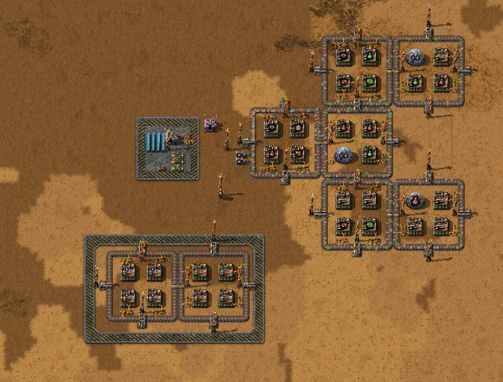

# Sushi Block

In factorio, a sushi belt is a belt with more types of item than it has lanes.
Sushi block is a modular way of arranging sushi belts into square blocks.



Blueprints are surrounded by hazard concrete, a small working factory is on the right.

Sushi usually requires some sort of circuit control to ensure the belts contain a good mix of items.
Items "diffuse" throughout the factory, and eventually everything gets crafted.
The circuit control is described below:

## Wiring Details

There are two circuit networks used throughout the base, red (material **removed** from belts) and green (material **added** to belts).
We use a constant combinator to store negative our **goal** state (e.g. -30 iron belts).
We also use the green network to store the **demand** (the amount of stuff missing from the belt to achieve our goal).

Inserters removing from belts are set to "read, pulse", and wired to the red network.
Inserters putting onto belts are set to "read, pulse"; and "enable if (thing it's outputting) < 0", wired to the green network.

combinators are (top to bottom):
```
Settings                  | Left (Red, Green)  | Right                       | Outputs
-----------------------------------------------------------------------------------------------
(each * -1 -> each)       | R: main network    | G: main network             | -removed[t-1]
(1 == 1 -> everything)    | G: main network    | G: main network             | added[t-1] # we need this as a one-tick delay
(each * -1 -> each)       | R: constant comb.  | G: main network, const comb | goal[t] - goal[t-1]
```

## In equations

```
demand[t+1] = demand[t] + (added[t] - removed[t]) + (goal[t] - goal[t-1])

              \-------------------/        |         \------------------/
                green network         red network      const combinator - itself from one tick ago
```

## Blueprints

```
0eNrlXFtvpLgS/iuIxxUdYXOxiXZfztF52Ofd83R21KLBSVuhARmTbM4o/30NfSM07q5yZrQZrTQaBXB9lP2Vy3ZV0V/9TdWLVslarzdN8+Tffz3f6fz7/00uh2el6AolWy2b2r/3/6VyWXeebrxd/iS8ru+20ntp1NOd90f9R/1r3QmlhTIt8idZP3oPqtl5eiu8jah053Xbpq9Kc+EpUd5N27e91oNAp/uHB6+pF4UelRD13fCi37dCKq8Tum8nz4umlaI8v1S/NJ48vWIrlNir+Xvj5WXplWKX16Z5o7y89qQWu2C8X4vHXMtn4eW7pjfD1NTrvSam2wNs0dSdzmtt/thtZJ3rRt153girhNFpbFQLPYxL4BWVyNW5O8HwZ+2VsjMwtSi0N+igxPFqaChrMxzei1Ti+MpcSb3dCS2Ldy/1A18O2oy0dfKxzquBM/3aCkPW0CPTos53w9UZYnWG8N8MQl2KP/178vYl8EWtpZZiDzhevK7rfrcRyjQ4QXVNlatVm9eiMvht08m9eXz1DQ67SwL/1b+n5o+3t+AChp41Kop+11ejHhcwJDygLGFEJ4wjvQsAdKpI4JdmOIv9c6OCGTWtmsoQu82fpVHACBVSFb3Ua/OsPCE9SNXp9Y2xfWmachjKo2X49+FwsWtzNfbu3v95fHx4gRJ5ud4a3odXaTHOO616sUeo92p2w9vI8N9o9lNGZOnfJ29f3paGJkYNTTofmvT60OyaUqybh3XTCtOzUSJy7pfxAdBeJade7UQp+91KVAZNGVtum0pc9jA7dpCPHQS+PZ68ebhOz10bLscZskhGNBPkc8Grj6ml0+mNuXvJK9l3OgMa/Bn2bPPdFaN/lkr3eXW2+32LlciL7WDf3eDFRvIPs2BlFJqYiv+TEW16bbwbFvwNZ0OBT60zBzj67KTIsT9Xx54fLC4iR4u7GO4HWQ0LEcRZS9XUq9a4RrF3K/04mnE48dYBDOTRrD6rl60wrnqCRM5IFICU97rZjSSuukKKuhDG+xdPFkQSAiDNWm0M43ofycgkkPYMOlkzGP/8pGopClkaXQFTLwqBU++A+bF5RyaTDif0bm36xWVWPgv1qrdmy7aHa1/XI4PrYfO1HjcwB9+PXdSuTd10Tl0wEw9cmM4c/exhqv9T/Sy7QRaDrHpmkmpZHTacs2E+LOFmVT6qus3/n6vScFMXSmixqsSD9ofXLEsmzpKpsyRzluTOkpmrZBQ6SxJnSYqXTG9agpKP22uiE1M4ylxpnaJaM1RrjmqdYVpP6QS0JqjW1GHwmTtvDMUbQ/HGULwxFG8MxRtD8cZQvDF33rg7bxzFG0fxxlG8cRRvHMUbR/HGUbxxd94yd94yFG8ZircMxVuG4i1D8ZaheMtQvGXuvB2DXfEHZIHMHZunuOYM15zjmmeo5lD6js0JrrkTgeQDBBIcgQRHIMERSHAEEhyBBEcgwRFIPkAg/QCBFEcgxRFIcQRSHIEURyDFEUhxBNIPEBg5nxaPoom7aOouytxFubto5izqcmY8ihJ30Zunxi/BPsJ4P8lfBn6Vb0Rl7v02Zir36Utz+1mobh+x4SRmGWVRxggj0TkdNsYwr2VC804WXquash9DJV5fSz3mErM/s0NidFM1xVM3ZCtl55l/Qyavk7u2Ep32TD87uamEd9DFax6mYvtM5X+GMJvXGEHlFaKqBpSHSratKAOvkk/Cy71iK7rO2zRmTEzPujpvV7pZPaohyDL1i2QY/XzTNVVvBm1o1w7huzFKh8kjdp3YbSojutrlxVbWYh9SRASmtcrrrm2UXg0p0YkwReQg20rqxexWcojEh7PY3NVcpB2OpMt46dW8JCxNdcJeEUyeKkmswe1kzKAZNYRxlJumH9MNSfLlaqZwxseFmuFxBC7inVdTdVBYspwoTsFABKMfAyRIo4lmf29ClNxOT9i7Qd91YzIu8fVOfYv8NLkdbb9FK8XQOuzegbgRCpeAcWMULkX6imRuk7AY/fsYPEnnKZNwfmOeRGHM6mz4HD1yQr/0V2GQJAFjS16LQGo/2Gc0fAJ3uCnKkuAel6FwU8BI88/vKQkDjw9HjQ8H42YoXLiHJNaVOV7a7cBdJCEoYILXmICAKV5jGHAEB7YuF0s7QAqf5ISigOGznCQoYMQ+K0YBw+cdYShg+MQjGQoYMfM4BjiCzzxKUMAED2zZbkfwuUZDlI4R+kRALSrijyyRBSm5fp617hlteCkSj93AY3iPSiGOL+J4jwoDdli1Ighw7LBqwYAJqlQWWUT8TWp8rUW+FKN69NmKfK3dipCz6LQgWaZRHGMB+Q3ABO9vLc4sTvFQNq0gMQ0aOprDN7FkbqOcY1THTsLvbsnWbmWAyOI+35gsc5qEyPjA6mgkCSZAQKj1dL8/UM2O5oQuHcoTgl6YY0u3QSFZMunoDS+fRPh1KQYBx/h1CQaM/djh5OhRzMfz6lkyv3ERzZnHe/j8gwlCwmvm9L5xTLDvS9nS+xZsNIiChAfm6aKxOjhem7UygLVSenWecyTbJ2eIY5vfjMTZPUHMbglzBk47JBnaV1i+JEtDNFJqQSKOxwGbZtTxOGDDc3BiDOJrUgcnBgNO8BqnIOAUrzEMmGH21OwzHQdS7rpvttlb5rpvtgAyhwCIDcoh5GGZ9oxiNp/sR9l8MnzAJbMMED7gwi1ICSJfmSHTNt97pPdJqqVepYhkcnYzRfItnIRdV+aYcMyQ54nZtuJin8HhW0Q2T1eyDHwmYRyRKPxxLC5DJOX+ZovjIX4PkEGWau6Qb+IgYId8E0zjCA8M0xj1vT//USKB3CHOZlnDuMNxz7KIcVScjX+mOBvn+LKs0DIKGbowi4ASRVmILg0CAhN0bRAQmKKLg4DAEaLQcSzsvAWILz4BaoqvPgECp+iyDSAwQ9dtAIG5QxkEDDlzqIMAls2F+IIFKDTBF1lAoSm+aAEKHeELLaDQMabeeD6tlyETfJEFVNsUXw0BhWb4Cg4oNHeoiLCsdCTM8DURQD1J6ForTuj3rhWHfErxb1FVnUdA31KQJcTV+OtzF19oDN8+mLvvP7aYPPPME/k4fsRx5ZMF249c/HbzSwWb5H/ffaYQOL4zQkn+OpGMhzHMi+F36dbHT1SujP3bX7z+nm8=
```